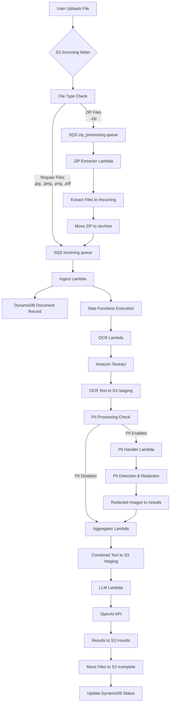

# Document Processing Workflow Overview

This document provides a comprehensive overview of the AWS document processing pipeline workflow, including the complete flow from file upload to final results.

## 🏗️ High-Level Architecture



## 📋 Workflow Steps

### 1. File Upload & Trigger
**Location**: S3 `/incoming/` folder
**Trigger**: S3 ObjectCreated event
**Delay**: 10-15 seconds for S3 notifications

```bash
# User uploads file
aws s3 cp document.jpg s3://bucket/incoming/document-name_1.jpg
```

**What Happens**:
- S3 detects new object in `/incoming/` folder
- S3 sends event notification to SQS queue
- SQS receives message with S3 event details

### 2. Message Processing
**Component**: Multiple SQS Queues
**Purpose**: Reliable message delivery with retry capability and file type routing

**Queue Types**:
- **`incoming` queue**: Regular files (.jpg, .jpeg, .png, .pdf)
- **`zip_processing` queue**: ZIP files (.zip)
- **`pii_processing` queue**: PII processing requests

**SQS Message Structure**:
```json
{
  "Records": [
    {
      "eventSource": "aws:sqs",
      "body": "{\"Records\":[{\"eventSource\":\"aws:s3\",\"s3\":{\"bucket\":{\"name\":\"bucket\"},\"object\":{\"key\":\"incoming/document-name_1.jpg\"}}}]}"
    }
  ]
}
```

### 3. Document Ingestion
**Component**: Ingest Lambda (`ingest_handler.py`)
**Purpose**: Parse S3 events, create document records, trigger processing

**Process**:
1. Parse SQS message to extract S3 event
2. Extract document ID and page number from filename
3. Create/update DynamoDB document record
4. Start Step Functions execution

**Filename Pattern**: `{document_id}_{page_number}.{extension}` or `{document_id}-{page_number}.{extension}`
- Example: `invoice-123_1.jpg`, `contract-456_2.pdf`, `report-789-1.png`, `document-abc-2.pdf`
- **Multi-page documents**: Files with the same `document_id` (before the separator) will be grouped together
- **Supported separators**: Both underscores (`_`) and dashes (`-`) are supported

**DynamoDB Record Created**:
```json
{
  "document_id": "invoice-123",
  "status": "AWAITING_PAGES",
  "pages_received": 1,
  "pages": ["incoming/invoice-123_1.jpg"],
  "textract_jobs": {},
  "ocr_text_keys": [],
  "created_at": "2025-10-11T18:00:00.000Z"
}
```

### 4. Smart Batching for Multi-Page Documents

**New Feature**: The system now uses **Smart Batching** to handle multi-page documents efficiently and reliably.

#### How Smart Batching Works:

1. **Single Page Documents**: Process immediately (no delay)
2. **Multi-Page Documents**: Use a 3-second processing window
3. **Window Reset**: Each new page resets the 3-second timer
4. **Automatic Processing**: Window processor triggers processing when timer expires

#### Processing Logic:

```python
# Smart Batching Decision Tree
if len(pages) == 1 and status == 'AWAITING_PAGES':
    # Single page - process immediately
    start_processing()
    
elif status == 'PROCESSING_WINDOW':
    # Document in window - reset timer
    reset_processing_window(3_seconds)
    
elif status == 'AWAITING_PAGES' and len(pages) > 1:
    # Multiple pages - start window
    start_processing_window(3_seconds)
```

#### Benefits:

- ✅ **Fast Processing**: Single pages process immediately (0 delay)
- ✅ **Reliable Batching**: Multi-page documents wait for all pages
- ✅ **No Race Conditions**: Handles simultaneous uploads correctly
- ✅ **Cost Efficient**: Minimal wasted compute resources
- ✅ **Scalable**: Works with any number of pages (1-100+)

#### Example Scenarios:

**Scenario 1: Single Page**
```
Time 0s: invoice-123_1.jpg → Process immediately
```

**Scenario 2: Multi-Page (Sequential)**
```
Time 0s:  invoice-123_1.jpg → Start 3s window
Time 2s:  invoice-123_2.jpg → Reset window (expires at 5s)
Time 5s:  Window expires → Process both pages
```

**Scenario 3: Multi-Page (Simultaneous)**
```
Time 0s:  invoice-123_1.jpg → Start 3s window
Time 0.1s: invoice-123_2.jpg → Reset window (expires at 3.1s)
Time 0.2s: invoice-123_3.jpg → Reset window (expires at 3.2s)
Time 3.2s: Window expires → Process all 3 pages
```

### 5. Workflow Orchestration
**Component**: Step Functions State Machine
**Purpose**: Coordinate the entire processing pipeline

**State Machine Definition**:
```json
{
  "StartAt": "OCR",
  "States": {
    "OCR": {
      "Type": "Task",
      "Resource": "arn:aws:states:::lambda:invoke",
      "Next": "CheckOCRComplete"
    },
    "CheckOCRComplete": {
      "Type": "Choice",
      "Choices": [
        {
          "Variable": "$.status",
          "StringEquals": "ocr_complete",
          "Next": "AggregateText"
        }
      ],
      "Default": "WaitForOCR"
    },
    "WaitForOCR": {
      "Type": "Wait",
      "Seconds": 30,
      "Next": "OCR"
    },
    "AggregateText": {
      "Type": "Task",
      "Resource": "arn:aws:states:::lambda:invoke",
      "Next": "LLM"
    },
    "LLM": {
      "Type": "Task",
      "Resource": "arn:aws:states:::lambda:invoke",
      "End": true
    }
  }
}
```

### 5. OCR Processing
**Component**: OCR Lambda (`ocr_handler.py`)
**Purpose**: Extract text from images/PDFs using Amazon Textract

**Process**:
1. Start asynchronous Textract job for each page
2. Poll for job completion
3. Extract text from Textract response
4. Save text to S3 `/staging/` folder
5. Update DynamoDB with OCR status

**S3 Structure After OCR**:
```
/staging/document-name/
├── text_page_1.txt
├── text_page_2.txt
└── ...
```

**DynamoDB Update**:
```json
{
  "status": "OCR_RUNNING",
  "textract_jobs": {
    "incoming/document-name_1.jpg": "job-id-123"
  },
  "ocr_text_keys": ["staging/document-name/text_page_1.txt"]
}
```

**Return to Step Functions**:
```json
{
  "status": "ocr_complete",
  "document_id": "document-name",
  "pages": ["incoming/document-name_1.jpg"],
  "bucket_name": "bucket-name",
  "ocr_text_keys": ["staging/document-name/text_page_1.txt"]
}
```

### 6. Text Aggregation
**Component**: Aggregator Lambda (`aggregator_handler.py`)
**Purpose**: Combine OCR text from multiple pages into single document

**Process**:
1. Read all OCR text files from S3
2. Combine text in page order
3. Save combined text to S3
4. Update DynamoDB status

**S3 Structure After Aggregation**:
```
/staging/document-name/
├── text_page_1.txt
├── text_page_2.txt
└── combined.txt  ← New combined text file
```

**Return to Step Functions**:
```json
{
  "status": "aggregated",
  "document_id": "document-name",
  "combined_key": "staging/document-name/combined.txt",
  "pages": ["incoming/document-name_1.jpg"]
}
```

### 7. ZIP File Processing
**Component**: ZIP Extractor Lambda (`zip_extractor.py`)
**Purpose**: Extract ZIP files and process individual files

**Process**:
1. Download ZIP file from S3 `/incoming/` folder
2. Extract all files from ZIP archive
3. Generate unique filenames to avoid conflicts
4. Upload extracted files to S3 `/incoming/` folder
5. Move original ZIP file to S3 `/archive/` folder
6. Extracted files trigger normal processing workflow

**ZIP Processing Flow**:
```
ZIP File Upload → S3 /incoming/ → SQS zip_processing → ZIP Extractor Lambda
                                                                    ↓
Archive ZIP File ← Move to /archive/ ← Extract Files ← Download ZIP
                                                                    ↓
Extracted Files → Upload to /incoming/ → Trigger Regular Processing
```

**Supported File Types in ZIP**:
- Images: `.jpg`, `.jpeg`, `.png`
- Documents: `.pdf`, `.txt`, `.doc`, `.docx`
- All extracted files are processed through normal OCR pipeline

### 8. PII Detection & Redaction
**Component**: PII Handler Lambda (`pii_handler.py`)
**Purpose**: Detect and redact personally identifiable information

**Process**:
1. Receive document after OCR completion
2. Analyze OCR text for PII patterns
3. Map PII text to image coordinates using Textract
4. Redact PII areas in original images
5. Save redacted images to S3 `/results/` folder
6. Generate PII analysis report

**PII Detection Patterns**:
- **SSN**: `\b\d{3}-\d{2}-\d{4}\b`
- **Account Numbers**: `\b\d{4}[\s-]?\d{4}[\s-]?\d{4}[\s-]?\d{4}\b`
- **Email Addresses**: `\b[A-Za-z0-9._%+-]+@[A-Za-z0-9.-]+\.[A-Z|a-z]{2,}\b`
- **Phone Numbers**: `\b\d{3}[-.]?\d{3}[-.]?\d{4}\b`
- **Addresses**: Street addresses with house numbers
- **Personal Names**: Context-aware name detection

**PII Processing Results**:
```json
{
  "status": "PII_PROCESSED",
  "detected_pii": true,
  "redacted_images": ["results/doc123_page_1_redacted.jpg"],
  "pii_detections": [
    {
      "type": "ssn",
      "text": "123-45-6789",
      "confidence": "high"
    }
  ],
  "processing_summary": {
    "total_pages": 2,
    "pages_with_pii": 1,
    "total_pii_instances": 3,
    "pii_types_detected": ["ssn", "email"]
  }
}
```

### 9. LLM Analysis
**Component**: LLM Lambda (`llm_handler.py`)
**Purpose**: Analyze document content using OpenAI API

**Process**:
1. Read combined text from S3
2. Load classification schemas from S3
3. Call OpenAI API for document analysis
4. Save results to S3 `/results/` folder
5. Move original files to S3 `/complete/` folder
6. Update DynamoDB with final status

**OpenAI API Call**:
```json
{
  "model": "gpt-3.5-turbo",
  "messages": [
    {
      "role": "system",
      "content": "You are a document analysis assistant. Respond only with valid JSON."
    },
    {
      "role": "user",
      "content": "Please analyze the following document text and extract information according to this schema: ..."
    }
  ]
}
```

**Results Saved to S3**:
```
/results/document-name_response.json
```

**Files Moved to S3**:
```
/complete/document-name/
└── document-name_1.jpg  ← Original file moved here
```

**Final DynamoDB Status**:
```json
{
  "status": "COMPLETE",
  "result_key": "results/document-name_response.json",
  "updated_at": "2025-10-11T18:05:00.000Z"
}
```

## 🔄 Error Handling & Retry Logic

### SQS Retry Mechanism
- **Max Retries**: 3 attempts
- **Dead Letter Queue**: Failed messages after 3 retries
- **Visibility Timeout**: 60 seconds

### Step Functions Retry Logic
```json
{
  "Retry": [
    {
      "ErrorEquals": ["States.ALL"],
      "IntervalSeconds": 30,
      "MaxAttempts": 3,
      "BackoffRate": 2.0
    }
  ]
}
```

### Lambda Error Handling
- **Timeout**: OCR Lambda (300s), LLM Lambda (300s), Others (60s)
- **Memory**: OCR (128MB), LLM (512MB), Others (256MB)
- **Error Logging**: All errors logged to CloudWatch
- **DynamoDB Updates**: Error status recorded in document record

## 📊 Status Tracking

### Document Status Flow
```
AWAITING_PAGES → PROCESSING_WINDOW → OCR_RUNNING → AGGREGATING → LLM_RUNNING → COMPLETE
                     ↓                    ↓
                  FAILED (on error)   FAILED (on error)
```

**PII Processing Flow** (parallel to main flow):
```
OCR_COMPLETE → PII_PROCESSING → PII_COMPLETE
                     ↓
                  PII_FAILED (on error)
```

### DynamoDB Status Values
- **`AWAITING_PAGES`**: Document created, waiting for processing
- **`PROCESSING_WINDOW`**: Multi-page document in batching window (3-second timer)
- **`OCR_RUNNING`**: Textract jobs in progress
- **`AGGREGATING`**: Combining OCR text from pages
- **`LLM_RUNNING`**: OpenAI analysis in progress
- **`COMPLETE`**: Processing finished successfully
- **`FAILED`**: Error occurred during processing

### PII Processing Status Values
- **`PII_PROCESSING`**: PII detection and redaction in progress
- **`PII_COMPLETE`**: PII processing finished successfully
- **`PII_FAILED`**: PII processing encountered an error

## 🎯 Performance Characteristics

### Processing Times
- **Small Documents (1-2 pages)**: 30-60 seconds
- **Large Documents (5+ pages)**: 2-5 minutes
- **Complex Documents**: Up to 10 minutes

### Scalability
- **Concurrent Processing**: Unlimited (Step Functions scales automatically)
- **SQS Throughput**: 300 messages/second per queue
- **Lambda Concurrency**: 1000 concurrent executions (default)
- **Textract Limits**: 3000 pages per month (free tier)

### Cost Optimization
- **S3 Storage**: Intelligent tiering for long-term storage
- **Lambda**: Pay per execution (no idle costs)
- **DynamoDB**: On-demand billing for variable workloads
- **Textract**: Pay per page processed

## 🔍 Monitoring & Observability

### CloudWatch Metrics
- **Lambda**: Duration, errors, throttles
- **Step Functions**: Execution success/failure rates
- **SQS**: Queue depth, message age
- **DynamoDB**: Read/write capacity, throttling

### Logging
- **Lambda Logs**: All functions log to CloudWatch
- **Step Functions**: Execution history and state transitions
- **S3**: Access logs (if enabled)

### Alerts
- **Failed Executions**: Step Functions failures
- **Queue Depth**: SQS messages backing up
- **Lambda Errors**: Function execution failures
- **DynamoDB Throttling**: Capacity issues

## ⚙️ Configuration Management

### Feature Flags
The system uses a DynamoDB `config` table to manage feature flags and processing options.

**Configuration Table Structure**:
```json
{
  "config_key": "pii_processing",
  "config_type": "feature_flag",
  "enabled": true,
  "conditions": {
    "s3_buckets": ["docproc-bucket"],
    "document_types": ["all"]
  },
  "settings": {
    "confidence_threshold": "medium",
    "redaction_method": "white_box"
  }
}
```

### PII Processing Configuration
**Enable/Disable PII Processing**:
```bash
# Enable PII processing for specific buckets
aws dynamodb put-item --table-name docproc-config --item '{
  "config_key": {"S": "pii_processing"},
  "config_type": {"S": "feature_flag"},
  "enabled": {"BOOL": true},
  "conditions": {
    "M": {
      "s3_buckets": {
        "L": [{"S": "docproc-bucket"}]
      }
    }
  }
}'
```

### Schema Management
**Upload Classification Schemas**:
```bash
# Upload schema files to S3
aws s3 cp banking.json s3://docproc-bucket/system-schemas/banking.json
aws s3 cp credit_cards.json s3://docproc-bucket/system-schemas/credit_cards.json
aws s3 cp insurance.json s3://docproc-bucket/system-schemas/insurance.json
```

**Available Schema Types**:
- `classification.json`: Document type classification
- `banking.json`: Banking document extraction
- `credit_cards.json`: Credit card document extraction
- `insurance.json`: Insurance document extraction
- `invoice.json`: Invoice and receipt extraction

## 🛠️ Troubleshooting Guide

### Common Issues

#### Files Not Processing
1. **Check S3 Notifications**: Verify notification configuration
2. **Check SQS Queue**: Look for messages in queue
3. **Check Lambda Logs**: Review ingest function logs
4. **Check DynamoDB**: Verify document record created

#### OCR Timeouts
1. **Increase Lambda Timeout**: Set to 300+ seconds
2. **Check File Size**: Large files need more time
3. **Check Textract Limits**: Verify account limits

#### LLM Analysis Failures
1. **Check OpenAI API Key**: Verify secret in Secrets Manager
2. **Check Schema Files**: Ensure schemas uploaded to S3
3. **Check Lambda Memory**: Increase to 512MB for LLM function

#### Step Functions Stuck
1. **Check Lambda Responses**: Ensure proper status returned
2. **Check Retry Logic**: Verify retry configuration
3. **Check Execution History**: Review Step Functions logs

#### ZIP Files Not Extracting
1. **Check ZIP Queue**: Verify messages in zip_processing queue
2. **Check ZIP Extractor Logs**: Review Lambda function logs
3. **Check File Size**: Large ZIP files may timeout
4. **Check Archive Folder**: Verify ZIP files moved to /archive/

#### PII Processing Issues
1. **Check PII Configuration**: Verify feature flag enabled in config table
2. **Check PII Queue**: Verify messages in pii_processing queue
3. **Check PII Handler Logs**: Review Lambda function logs
4. **Check PIL Layer**: Ensure Pillow layer is properly attached
5. **Check Image Format**: Ensure images are in supported formats

### Debug Commands
```bash
# Check document status
aws dynamodb get-item --table-name docproc-documents --key '{"document_id": {"S": "document-name"}}'

# Check Step Functions execution
aws stepfunctions describe-execution --execution-arn arn:aws:states:...

# Check Lambda logs
aws logs describe-log-streams --log-group-name /aws/lambda/function-name
aws logs get-log-events --log-group-name /aws/lambda/function-name --log-stream-name stream-name

# Check SQS queue
aws sqs get-queue-attributes --queue-url https://sqs.region.amazonaws.com/account/queue-name --attribute-names ApproximateNumberOfMessages

# Check ZIP processing queue
aws sqs get-queue-attributes --queue-url https://sqs.region.amazonaws.com/account/docproc-queue-zip --attribute-names ApproximateNumberOfMessages

# Check PII processing queue
aws sqs get-queue-attributes --queue-url https://sqs.region.amazonaws.com/account/docproc-queue-pii --attribute-names ApproximateNumberOfMessages

# Check PII configuration
aws dynamodb get-item --table-name docproc-config --key '{"config_key": {"S": "pii_processing"}, "config_type": {"S": "feature_flag"}}'

# List files in archive folder
aws s3 ls s3://docproc-bucket/archive/

# List PII results
aws s3 ls s3://docproc-bucket/pii-results/
```

## 🔐 Security Considerations

### Data Protection
- **Encryption**: S3 server-side encryption enabled
- **Secrets**: OpenAI API key stored in Secrets Manager
- **IAM**: Least privilege access for all resources
- **VPC**: Consider VPC endpoints for production

### Access Control
- **S3 Bucket Policy**: Restrict access to specific roles
- **Lambda Execution Role**: Minimal required permissions
- **Step Functions Role**: Only invoke specific Lambda functions
- **DynamoDB**: IAM-based access control

## 📈 Future Enhancements

### Current Features
- **ZIP File Processing**: Automatic extraction and processing of ZIP archives
- **PII Detection & Redaction**: Automatic detection and redaction of sensitive information
- **Smart Batching**: Intelligent multi-page document processing with 3-second windows
- **Multi-page Document Support**: Processing of documents with multiple pages
- **Schema-based Classification**: Configurable document classification and extraction
- **Feature Flag Management**: Dynamic configuration of processing options

### Planned Features
- **Multi-language Support**: OCR for additional languages
- **Custom Schemas**: User-defined classification schemas via web interface
- **Batch Processing**: Process multiple documents simultaneously
- **Webhook Notifications**: Real-time status updates
- **Dashboard**: Web interface for monitoring and management
- **Advanced PII Detection**: Machine learning-based PII detection
- **Document Comparison**: Side-by-side document analysis

### Scalability Improvements
- **Auto-scaling**: Dynamic Lambda concurrency limits
- **Regional Deployment**: Multi-region processing
- **Caching**: Redis for frequently accessed data
- **CDN**: CloudFront for global document access

---

*This workflow overview should be updated as the system evolves. For implementation details, see [AGENT.md](../AGENT.md).*
