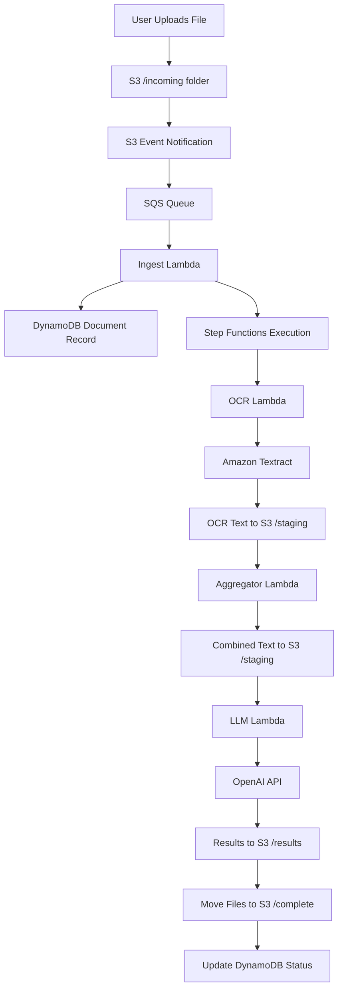

# Document Processing Workflow Overview

This document provides a comprehensive overview of the AWS document processing pipeline workflow, including the complete flow from file upload to final results.

## 🏗️ High-Level Architecture



## 📋 Workflow Steps

### 1. File Upload & Trigger
**Location**: S3 `/incoming/` folder
**Trigger**: S3 ObjectCreated event
**Delay**: 10-15 seconds for S3 notifications

```bash
# User uploads file
aws s3 cp document.jpg s3://bucket/incoming/document-name_1.jpg
```

**What Happens**:
- S3 detects new object in `/incoming/` folder
- S3 sends event notification to SQS queue
- SQS receives message with S3 event details

### 2. Message Processing
**Component**: SQS Queue
**Purpose**: Reliable message delivery with retry capability

**SQS Message Structure**:
```json
{
  "Records": [
    {
      "eventSource": "aws:sqs",
      "body": "{\"Records\":[{\"eventSource\":\"aws:s3\",\"s3\":{\"bucket\":{\"name\":\"bucket\"},\"object\":{\"key\":\"incoming/document-name_1.jpg\"}}}]}"
    }
  ]
}
```

### 3. Document Ingestion
**Component**: Ingest Lambda (`ingest_handler.py`)
**Purpose**: Parse S3 events, create document records, trigger processing

**Process**:
1. Parse SQS message to extract S3 event
2. Extract document ID and page number from filename
3. Create/update DynamoDB document record
4. Start Step Functions execution

**Filename Pattern**: `{document_id}_{page_number}.{extension}` or `{document_id}-{page_number}.{extension}`
- Example: `invoice-123_1.jpg`, `contract-456_2.pdf`, `report-789-1.png`, `document-abc-2.pdf`
- **Multi-page documents**: Files with the same `document_id` (before the separator) will be grouped together
- **Supported separators**: Both underscores (`_`) and dashes (`-`) are supported

**DynamoDB Record Created**:
```json
{
  "document_id": "invoice-123",
  "status": "AWAITING_PAGES",
  "pages_received": 1,
  "pages": ["incoming/invoice-123_1.jpg"],
  "textract_jobs": {},
  "ocr_text_keys": [],
  "created_at": "2025-10-11T18:00:00.000Z"
}
```

### 4. Workflow Orchestration
**Component**: Step Functions State Machine
**Purpose**: Coordinate the entire processing pipeline

**State Machine Definition**:
```json
{
  "StartAt": "OCR",
  "States": {
    "OCR": {
      "Type": "Task",
      "Resource": "arn:aws:states:::lambda:invoke",
      "Next": "CheckOCRComplete"
    },
    "CheckOCRComplete": {
      "Type": "Choice",
      "Choices": [
        {
          "Variable": "$.status",
          "StringEquals": "ocr_complete",
          "Next": "AggregateText"
        }
      ],
      "Default": "WaitForOCR"
    },
    "WaitForOCR": {
      "Type": "Wait",
      "Seconds": 30,
      "Next": "OCR"
    },
    "AggregateText": {
      "Type": "Task",
      "Resource": "arn:aws:states:::lambda:invoke",
      "Next": "LLM"
    },
    "LLM": {
      "Type": "Task",
      "Resource": "arn:aws:states:::lambda:invoke",
      "End": true
    }
  }
}
```

### 5. OCR Processing
**Component**: OCR Lambda (`ocr_handler.py`)
**Purpose**: Extract text from images/PDFs using Amazon Textract

**Process**:
1. Start asynchronous Textract job for each page
2. Poll for job completion
3. Extract text from Textract response
4. Save text to S3 `/staging/` folder
5. Update DynamoDB with OCR status

**S3 Structure After OCR**:
```
/staging/document-name/
├── text_page_1.txt
├── text_page_2.txt
└── ...
```

**DynamoDB Update**:
```json
{
  "status": "OCR_RUNNING",
  "textract_jobs": {
    "incoming/document-name_1.jpg": "job-id-123"
  },
  "ocr_text_keys": ["staging/document-name/text_page_1.txt"]
}
```

**Return to Step Functions**:
```json
{
  "status": "ocr_complete",
  "document_id": "document-name",
  "pages": ["incoming/document-name_1.jpg"],
  "bucket_name": "bucket-name",
  "ocr_text_keys": ["staging/document-name/text_page_1.txt"]
}
```

### 6. Text Aggregation
**Component**: Aggregator Lambda (`aggregator_handler.py`)
**Purpose**: Combine OCR text from multiple pages into single document

**Process**:
1. Read all OCR text files from S3
2. Combine text in page order
3. Save combined text to S3
4. Update DynamoDB status

**S3 Structure After Aggregation**:
```
/staging/document-name/
├── text_page_1.txt
├── text_page_2.txt
└── combined.txt  ← New combined text file
```

**Return to Step Functions**:
```json
{
  "status": "aggregated",
  "document_id": "document-name",
  "combined_key": "staging/document-name/combined.txt",
  "pages": ["incoming/document-name_1.jpg"]
}
```

### 7. LLM Analysis
**Component**: LLM Lambda (`llm_handler.py`)
**Purpose**: Analyze document content using OpenAI API

**Process**:
1. Read combined text from S3
2. Load classification schemas from S3
3. Call OpenAI API for document analysis
4. Save results to S3 `/results/` folder
5. Move original files to S3 `/complete/` folder
6. Update DynamoDB with final status

**OpenAI API Call**:
```json
{
  "model": "gpt-3.5-turbo",
  "messages": [
    {
      "role": "system",
      "content": "You are a document analysis assistant. Respond only with valid JSON."
    },
    {
      "role": "user",
      "content": "Please analyze the following document text and extract information according to this schema: ..."
    }
  ]
}
```

**Results Saved to S3**:
```
/results/document-name_response.json
```

**Files Moved to S3**:
```
/complete/document-name/
└── document-name_1.jpg  ← Original file moved here
```

**Final DynamoDB Status**:
```json
{
  "status": "COMPLETE",
  "result_key": "results/document-name_response.json",
  "updated_at": "2025-10-11T18:05:00.000Z"
}
```

## 🔄 Error Handling & Retry Logic

### SQS Retry Mechanism
- **Max Retries**: 3 attempts
- **Dead Letter Queue**: Failed messages after 3 retries
- **Visibility Timeout**: 60 seconds

### Step Functions Retry Logic
```json
{
  "Retry": [
    {
      "ErrorEquals": ["States.ALL"],
      "IntervalSeconds": 30,
      "MaxAttempts": 3,
      "BackoffRate": 2.0
    }
  ]
}
```

### Lambda Error Handling
- **Timeout**: OCR Lambda (300s), LLM Lambda (300s), Others (60s)
- **Memory**: OCR (128MB), LLM (512MB), Others (256MB)
- **Error Logging**: All errors logged to CloudWatch
- **DynamoDB Updates**: Error status recorded in document record

## 📊 Status Tracking

### Document Status Flow
```
AWAITING_PAGES → OCR_RUNNING → AGGREGATING → LLM_RUNNING → COMPLETE
                     ↓
                  FAILED (on error)
```

### DynamoDB Status Values
- **`AWAITING_PAGES`**: Document created, waiting for processing
- **`OCR_RUNNING`**: Textract jobs in progress
- **`AGGREGATING`**: Combining OCR text from pages
- **`LLM_RUNNING`**: OpenAI analysis in progress
- **`COMPLETE`**: Processing finished successfully
- **`FAILED`**: Error occurred during processing

## 🎯 Performance Characteristics

### Processing Times
- **Small Documents (1-2 pages)**: 30-60 seconds
- **Large Documents (5+ pages)**: 2-5 minutes
- **Complex Documents**: Up to 10 minutes

### Scalability
- **Concurrent Processing**: Unlimited (Step Functions scales automatically)
- **SQS Throughput**: 300 messages/second per queue
- **Lambda Concurrency**: 1000 concurrent executions (default)
- **Textract Limits**: 3000 pages per month (free tier)

### Cost Optimization
- **S3 Storage**: Intelligent tiering for long-term storage
- **Lambda**: Pay per execution (no idle costs)
- **DynamoDB**: On-demand billing for variable workloads
- **Textract**: Pay per page processed

## 🔍 Monitoring & Observability

### CloudWatch Metrics
- **Lambda**: Duration, errors, throttles
- **Step Functions**: Execution success/failure rates
- **SQS**: Queue depth, message age
- **DynamoDB**: Read/write capacity, throttling

### Logging
- **Lambda Logs**: All functions log to CloudWatch
- **Step Functions**: Execution history and state transitions
- **S3**: Access logs (if enabled)

### Alerts
- **Failed Executions**: Step Functions failures
- **Queue Depth**: SQS messages backing up
- **Lambda Errors**: Function execution failures
- **DynamoDB Throttling**: Capacity issues

## 🛠️ Troubleshooting Guide

### Common Issues

#### Files Not Processing
1. **Check S3 Notifications**: Verify notification configuration
2. **Check SQS Queue**: Look for messages in queue
3. **Check Lambda Logs**: Review ingest function logs
4. **Check DynamoDB**: Verify document record created

#### OCR Timeouts
1. **Increase Lambda Timeout**: Set to 300+ seconds
2. **Check File Size**: Large files need more time
3. **Check Textract Limits**: Verify account limits

#### LLM Analysis Failures
1. **Check OpenAI API Key**: Verify secret in Secrets Manager
2. **Check Schema Files**: Ensure schemas uploaded to S3
3. **Check Lambda Memory**: Increase to 512MB for LLM function

#### Step Functions Stuck
1. **Check Lambda Responses**: Ensure proper status returned
2. **Check Retry Logic**: Verify retry configuration
3. **Check Execution History**: Review Step Functions logs

### Debug Commands
```bash
# Check document status
aws dynamodb get-item --table-name docproc-documents --key '{"document_id": {"S": "document-name"}}'

# Check Step Functions execution
aws stepfunctions describe-execution --execution-arn arn:aws:states:...

# Check Lambda logs
aws logs describe-log-streams --log-group-name /aws/lambda/function-name
aws logs get-log-events --log-group-name /aws/lambda/function-name --log-stream-name stream-name

# Check SQS queue
aws sqs get-queue-attributes --queue-url https://sqs.region.amazonaws.com/account/queue-name --attribute-names ApproximateNumberOfMessages
```

## 🔐 Security Considerations

### Data Protection
- **Encryption**: S3 server-side encryption enabled
- **Secrets**: OpenAI API key stored in Secrets Manager
- **IAM**: Least privilege access for all resources
- **VPC**: Consider VPC endpoints for production

### Access Control
- **S3 Bucket Policy**: Restrict access to specific roles
- **Lambda Execution Role**: Minimal required permissions
- **Step Functions Role**: Only invoke specific Lambda functions
- **DynamoDB**: IAM-based access control

## 📈 Future Enhancements

### Planned Features
- **Multi-language Support**: OCR for additional languages
- **Custom Schemas**: User-defined classification schemas
- **Batch Processing**: Process multiple documents simultaneously
- **Webhook Notifications**: Real-time status updates
- **Dashboard**: Web interface for monitoring and management

### Scalability Improvements
- **Auto-scaling**: Dynamic Lambda concurrency limits
- **Regional Deployment**: Multi-region processing
- **Caching**: Redis for frequently accessed data
- **CDN**: CloudFront for global document access

---

*This workflow overview should be updated as the system evolves. For implementation details, see [AGENT.md](../AGENT.md).*
